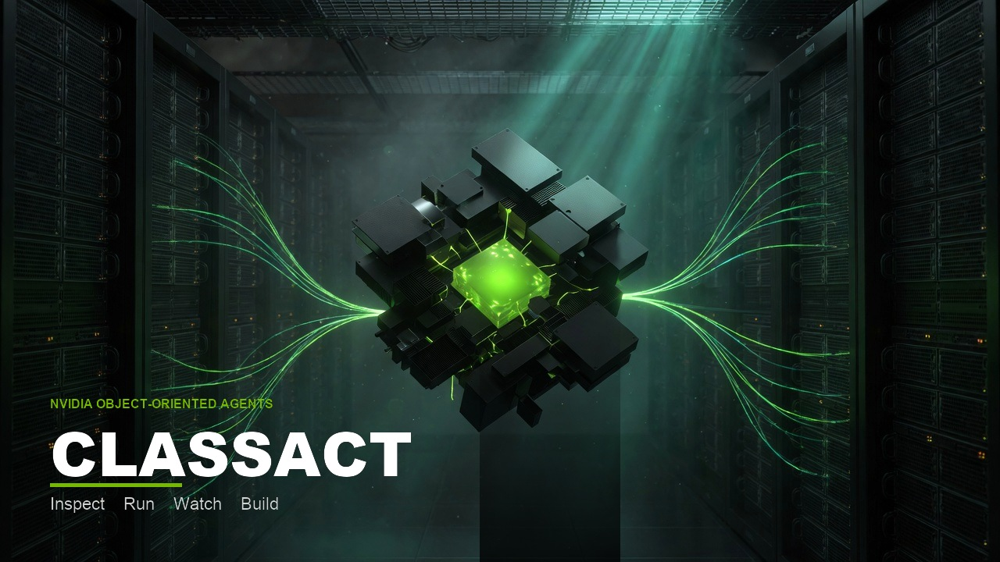

<p align="center">
  
</p>

# ClassAct

**A studio for [NVIDIA Object-Oriented Agents (NOOA)](https://github.com/NVIDIA-NeMo/labs-OO-Agents).**

Inspect a Python class. Run a method. Watch the call tree. Build a new agent.

The model is **open**: [Nemotron 3.5 Lightning](https://build.nvidia.com/nvidia/nemotron-3.5-lightning-30b-a3b) on hosted **NVIDIA NIM**. No local GPU is required.

| | |
|--|--|
| **Inspect** | Class, role docstring, fields, methods (`…` vs ordinary Python) |
| **Run** | Await a typed method against Lightning on NIM |
| **Watch** | Live span tree — methods, generations, LLM calls, CodeAct cells |
| **Build** | Live class graph: drag methods, toggle Predict / CodeAct / Python tools, generate a class |

```text
Browser  (black / green / white)
   │  HTTP + SSE
   ▼
ClassAct  FastAPI  ── inspect / run / watch / build
   │
   ├─ catalog/ + workspace/     Agent subclasses
   ├─ NOOA runtime              class = agent, … = LLM
   └─ LiteLLM ── HTTPS ──► NIM  Nemotron 3.5 Lightning
                                 (GPU stays in NVIDIA’s cloud)
```

## Why this name

**ClassAct** is a class, and an act.

- NOOA agents *are* Python classes.
- Agentic methods are implemented by **CodeAct** (or Predict).
- A “class act” is the standard this studio holds the object to: typed, inspectable, runnable.

## Quick start

```bash
python3 -m venv .venv
source .venv/bin/activate
pip install -r requirements.txt
cp .env.example .env   # set NVIDIA_API_KEY from build.nvidia.com
./run.sh
# → http://127.0.0.1:7877
```

Inspect and Build work without a key. Run and Watch need NIM.

```bash
# NVIDIA_API_KEY=nvapi-…
NOOA_MODEL=nvidia_nim/nvidia/nemotron-3.5-lightning-30b-a3b
NIM_MODEL_ID=nvidia/nemotron-3.5-lightning-30b-a3b
```

## Sample agents

| Agent | Strategy | What it shows |
|--|--|--|
| `ClassifierAgent` | Predict | Structured Pydantic output, no generated code |
| `SupportAgent` | CodeAct + Python tools | `get_order` / `is_refund_eligible` as live methods, `triage(...)` is `…` |

Build is a graphic object editor: the class sits in the center, methods orbit as nodes you can click and drag. Templates (Headline, Classifier, Support, Blank) seed the graph. Generate writes `workspace/` and the new class shows up under Inspect. From Inspect, **Open in Build** loads an existing agent onto the canvas.

## Safety

NOOA can execute model-generated Python (CodeAct). ClassAct defaults new agents to **Predict**. Sample CodeAct tools are in-memory only. Treat OS isolation ([NVIDIA OpenShell](https://github.com/NVIDIA/OpenShell), a container, or a VM) as the real containment boundary — do not point CodeAct at your home directory.

Never commit `NVIDIA_API_KEY`. `.env` is gitignored.

## Tests

```bash
python -m pytest -q
```

## GTC Berlin Golden Ticket

Built for the [NVIDIA GTC Berlin Golden Ticket Developer Contest](https://developer.nvidia.com/gtc-golden-ticket-contest) (open models, 18 Aug – 10 Sep 2026).

Suggested post:

> Inspect, run, watch, and build NVIDIA Object-Oriented Agents — as Python classes — on open **Nemotron 3.5 Lightning** via NIM. No GPU on my desk. Repo: (this URL)  #NVIDIAGTC

Tag the judge you heard it from.

## License

Apache-2.0. NOOA is NVIDIA-labs research software (Apache-2.0). Nemotron weights follow their own licenses (OpenMDW). This studio is a UI over those projects, not a fork of the runtime.
